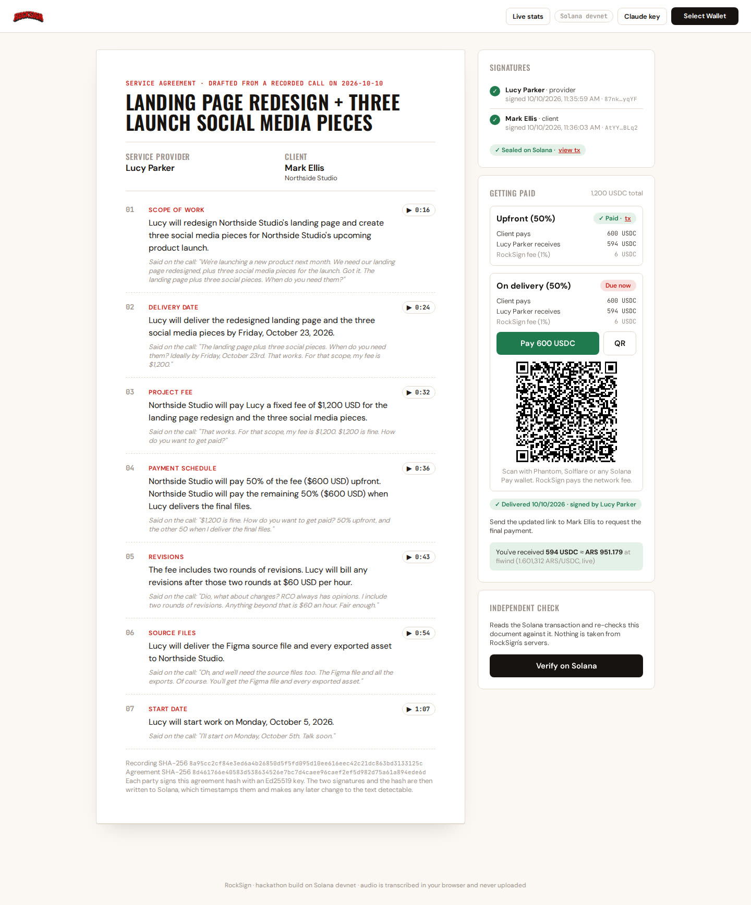
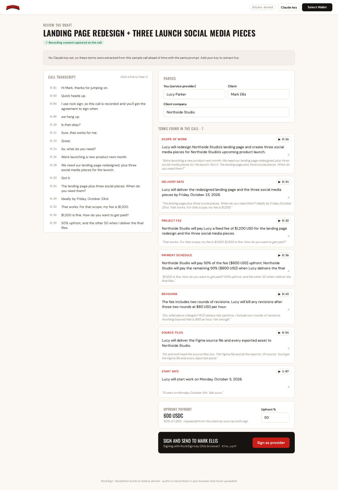
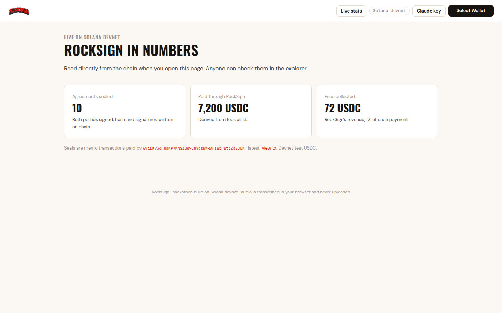
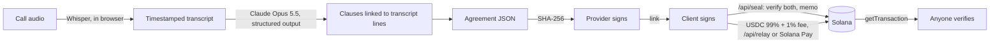

# RockSign

**What's said gets signed. And paid.**

RockSign is for freelancers who are paid in dollars by clients abroad. You close the job on a call. RockSign turns what you both agreed into an agreement your client signs with no wallet and no account, seals it on Solana, and collects the payments agreed on the call in USDC.

[](https://github.com/nicolandfree/RockSign/actions/workflows/ci.yml)

| | |
|---|---|
| **Live app** | https://rocksign.vercel.app (Solana devnet) |
| **Demo video** | _link added at submission_ |
| **Pitch deck** | [`dist/RockSign-Pitch.pdf`](dist/RockSign-Pitch.pdf) |
| **Built for** | Colosseum Crypto World's Fair hackathon, Sep 14 – Oct 12, 2026 |



## What it does

1. **Record the call, or upload it.** RockSign records the microphone and the meeting tab (Google Meet, Zoom, Teams in the browser). English and Spanish.
2. **Transcribe in the browser.** Whisper runs on the device. The audio is never uploaded.
3. **Extract the terms with receipts.** Claude drafts each clause: scope, deadline, fee, payment plan, revisions, handoff, start date. Every clause links to the second it was said, and a ▶ button replays it.
4. **Both sides sign.** Each party signs the SHA-256 of the agreement. The client needs no wallet and no SOL; a key in the browser or any Solana wallet works.
5. **Sealed on Solana.** The hash and both signatures go into one memo transaction. RockSign pays the fee.
6. **Get paid as agreed.** The deposit is due on signing. The balance is due once the freelancer signs a delivery notice. The client pays USDC in one tap, or scans a Solana Pay QR from any wallet. RockSign pays the gas.
7. **See it in pesos.** The freelancer sees what they received in ARS at the best live rate.
8. **Verify without trusting us.** Anyone holding the agreement can check it against the chain. A signed agreement downloads as a PDF with a QR to its seal.

| Review the draft | Live numbers, read from the chain |
|---|---|
|  |  |

## Try it in two minutes

1. Open https://rocksign.vercel.app and click **Try a sample call**. There is also a sample in Spanish.
2. Wait for the in-browser transcription. The first run downloads the speech model, about 80 MB.
3. Click **Sign as provider**. On the agreement page, click **Sign as Mark Ellis**: this browser plays both sides.
4. Click **Get 2,000 test USDC**, then **Pay 600 USDC**. Then **Mark work as delivered** and pay the balance.
5. Click **Verify on Solana**, and open the **view tx** links in Solana Explorer.

The sample calls use terms that Claude extracted ahead of time with the same prompt, because the hosted app keeps no API key. To extract terms live from your own recording, add your Claude API key from the header. The key stays in your browser.

## Business model

Freemium. Drafting, signing and sealing agreements is free. **RockSign takes 1% of each payment made through it.** The fee is split off inside the same Solana transaction: 99% goes to the freelancer and 1% to the RockSign treasury. Network fees are on RockSign.

## Check it on chain

- **Seals:** memo transactions paid by the sponsor [`6yiEK73q…SuLM`](https://explorer.solana.com/address/6yiEK73qHUsMP7MhSZBq9uHVdsNWRAHsWpHWt3ZsSuLM?cluster=devnet). Format: `rocksign:v1:<agreement sha256>:<provider>:<signature>:<client>:<signature>`.
- **Payments:** USDC transfers to the freelancer with the memo `rocksign:pay:<hash prefix>:<milestone>`, plus the 1% fee transfer to the treasury in the same transaction.
- **Stats:** [/stats](https://rocksign.vercel.app/#/stats) counts these from the chain. On devnet they are test activity, not traction.

## How it is built



- **Frontend:** React and Vite, static, on Vercel. The agreement travels in the link, and no server stores it.
- **Speech:** Whisper through transformers.js in a Web Worker. Audio is cut at pauses so every line keeps exact timestamps.
- **Extraction:** Claude Opus 5.5 with a JSON schema. Claude returns transcript line numbers, which become exact times.
- **Solana:** the Memo program, SPL Token `transferChecked`, Solana Pay transaction requests and Wallet Standard. Gas is sponsored by a fee payer that refuses to sign anything that could move its own funds.
- **Serverless API:** `/api/seal`, `/api/relay`, `/api/solana-pay` and `/api/faucet`. Each one checks the request before the sponsor signs anything, and each has a per-IP rate limit.

Details, setup and file layout: [app/README.md](app/README.md).

## Repository

| Path | What it is |
|---|---|
| [`app/`](app/) | The product: web app, serverless API, tests, scripts |
| [`app/tests/`](app/tests/) | Unit tests for hashing, signatures, the memo format, milestones, audio chunking and extraction mapping, plus the API security checks. Run with `npm test`. |
| [`app/scripts/e2e-chain.ts`](app/scripts/e2e-chain.ts) | End-to-end run against devnet: seal, tampered seal, both payments, Solana Pay, verification |
| [`video/`](video/) | Records the live app and builds the demo video (Playwright, Piper, ffmpeg) |
| [`pitch/`](pitch/) | Deck sources. `npm run deck` builds `dist/RockSign-Pitch.*` |
| [`demo/`](demo/) | The first concept video (Oct 4). It is a scripted simulation made before the app existed. |
| [`assets/`](assets/) | Logo, wordmark, fonts |

## Development

```bash
cd app
npm ci
npm test                                               # unit + API security tests, offline
node scripts/setup-devnet.ts ~/.config/solana/id.json  # once: sponsor key, test USDC mint, treasury, .env.local
npm run dev                                            # http://localhost:5173
npm run e2e:devnet                                     # full on-chain flow against devnet
```

## Hackathon disclosure

All work was done during the hackathon window (Sep 14 – Oct 12, 2026):

- **Oct 4:** pitch deck and a scripted concept video ([`demo/`](demo/), [`dist/RockSign-Demo.mp4`](dist/RockSign-Demo.mp4)), made before the product existed.
- **Oct 10 onward:** the working app in [`app/`](app/), built with AI coding assistance (Claude Code), as the commit history shows.

The project uses open-source libraries (Solana web3.js, SPL Token, Solana Pay, wallet-adapter, transformers.js, React, Vite) and the Claude API.

## License

[MIT](LICENSE). The RockSign name and logo are not covered by the license.

## Limits of this build

- Devnet only. The test USDC is a RockSign mint, not Circle USDC.
- The key generated in the browser lives in `localStorage`. Production would use an embedded wallet with recovery.
- On devnet the treasury is the sponsor's own USDC account. Production would use a separate treasury key.
- A wallet signature is an electronic signature. The on-chain record makes it tamper-evident and timestamped. Whether it is enough legally depends on the jurisdiction.
